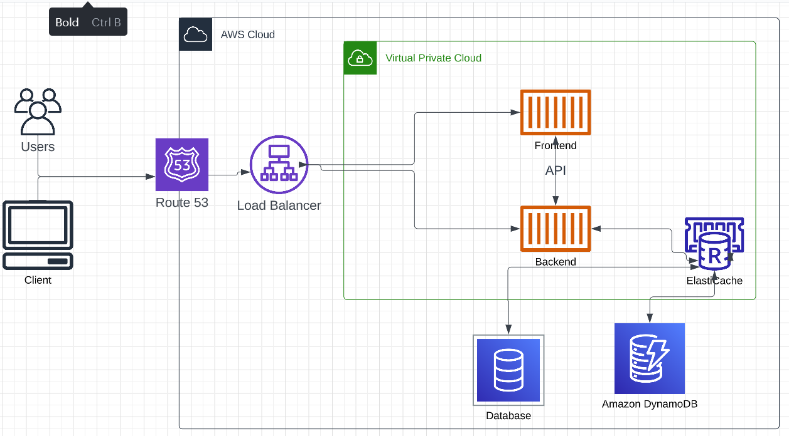

# Week 0 — Billing and Architecture

## Required Homework/Tasks

### Install and Verify AWS CLI

I was not able to use Gitpod or Github Codespaces due to browser issues
So I decided to use a local environment.

In order to prove that I am able to use the AWS CLI.
I am providing the instructions I used for my configuration of my local machine on windows.

I did the following steps to install AWS CLI

I installed the AWS CLI for Windows 10 via command in **Command Prompt**:

I followed the instructions on the [AWS CLI Install Documentation Page](https://docs.aws.amazon.com/cli/latest/userguide/getting-started-install.html)


```
msiexec.exe /i https://awscli.amazonaws.com/AWSCLIV2.msi
```

I attempted to run the command by typing in 'aws' but I recive an error

```
C:\Users|selam>aws
'aws' is not recognized as an internal or external command,
operable program or batch file.
```

I was able to resolve the error by closing command prompt, and opening it again.


### Create a Billing Alarm

### Create a Budget

I created my own Budget for $10 because I cannot affor any kind of spend.
I did not create a second Budget because I was concerned of budget spending going over the 2 budget free limit.


### Recreate Logical Architectural Design



[Lucid Charts Share Link](https://lucid.app/lucidchart/aec6d9f5-e6a3-42a2-8aaf-cb6a76a0fc63/edit?viewport_loc=-114%2C93%2C1707%2C753%2C0_0&invitationId=inv_85db70eb-26ed-45e7-91f2-634df1312b23)

## Homework Challenges

### Adding Security Components to the Logical Diagram

### Realtime Websockets

## References

